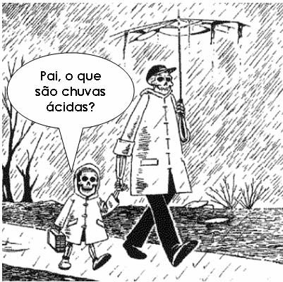

<DOCTYPE!html>
<html>
<head>
<title>O que são?</title>
<link rel="stylesheet" type="text/css" href="projeto grupo 3 theme.css">
</head>
<body>
<h1>O que são?</h1>

<b>
  A chuva ácida é chuva que tem um valor de pH inferior a 4,5(caracter ácido). 
  A acidez da chuva é causada pela utilizacao de alguns gases presentes na atmosfera cujo caracter seja ácido. Entre estes destacam-se os gases 
provenientes da queima dos combustíveis fósseis. 
  As chuvas "normais" tambem são ligeiramente ácidas, pois apresentam um valor de pH próximo de 5,6. Essa acidez natural é causada pelo dióxido de 
carbono que se junta com água, formando um ácido fraco, conhecido como ácido carbónico:  
CO2 (g) + H2O (l) ---› H2CO3 (aq) 
 
<a href="https://chuvas-acidas-grupo-3.000webhostapp.com/">Voltar</a>
</b>

</body>
</html>
